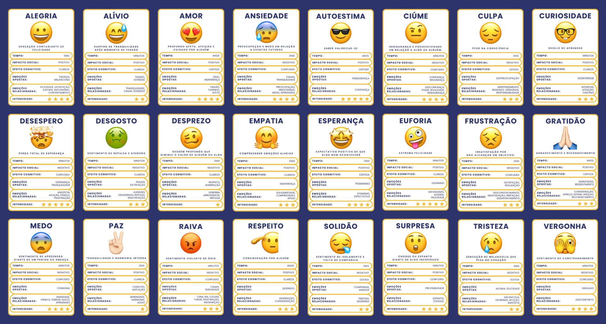
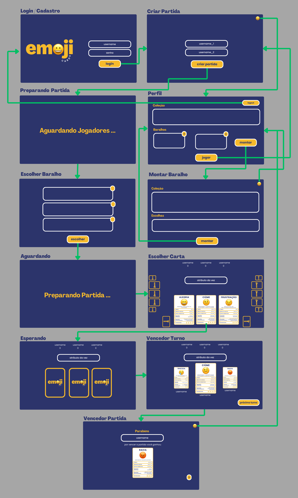

# EmojiCards


> Jogo de cartas desktop multi-usuários similar a jogos super trunfos destinado a envolver os usuários na exploração das emoções humanas. O objetivo é proporcionar aos jogadores a oportunidade de colecionar cartas, compor seus próprios baralhos e competir em um ambiente virtual colaborativo. Como incentivo adicional, os vencedores das partidas são recompensados com uma nova carta para expandir sua coleção. 

## Pré-requisitos

- **Docker**

## Como Executar
Siga as etapas abaixo para executar o jogo:

1. **Abra o terminal o diretório do projeto**

2. **Execute os seguintes comandos respeitando a ordem:**
    1. No Linux, primeiramente, é preciso executar o comando abaixo antes de executar os containers para liberar o acesso do seu display ao Docker:
    ```bash
    xhost +local:*
    ```
       
    2. Se for a primeira execução, é preciso usar o comando abaixo para preparar as imagens remotas:
    ```bash
    docker compose build
    ```

    3. Como o sistema utiliza Pyro5 para gerenciar a comunicação entre os processos distribuídos, é preciso que o servidor Pyro esteja em execução antes de subir os outros containers. Para isso, execute o comando a seguir para iniciar o Pyro5:
    ```bash
    docker compose up -d rmi-ns
    ```

    4. Feito isso, basta utilizar o comando abaixo para inicar os demais containers descritos no `docker-compose.yml`:
    ```bash
    docker compose up
    ```

    5. Com isso, o terminal Docker será iniciado. Para encerrá-lo basta fazer `Ctrl + C`
    
    6. Para destruir os containers é preciso utilizar o comando:
    ```bash
    docker compose down
    ```

#### Observações: Para facilitar a execução, o arquivo docker-compose.yml tem um conteiner para o servidor de banco de dados, um conteiner para o servidor de aplicação e três conteiners para três clientes, já que para jogar uma partida é preciso ter no mínimo três jogadores. Além disso, no banco de dados já existem três usuários cadastrados:
```
    |--------------|--------------|
    |   username   |    senha     |
    |--------------|--------------|
    |    thais     |   12345678   |
    |   henrique   |   12345678   |
    |    aluno     |   12345678   |
    |--------------|--------------|
```
## Cartas do Jogo
Atualmente o jogo possui 24 cartas desponíveis, elas são:


Quando um usuário cria uma conta o sistema cria sua coleção com 9 cartas escolhidas aleatoriamente. Para aumentar a coleção o jogador deve vencer partidas, e a cada partida ganha uma nova carta é adicionada à sua coleção.

### Descrição dos Atributos de cada Carta

#### Intensidade
Atributo numérico que reflete a intensidade da emoção representada pela carta. Quanto maior o valor, maior é a intensidade da emoção. Na comparação, o valor mais alto vence. O valor máximo é 5 e o mínimo 1.

#### Tempo de Duração da Emoção
Descreve por quanto tempo a emoção tende a persistir no indivíduo após ser desencadeada. Ele pode ser medido em termos de minutos, dias ou anos.  Na comparação, emoções com um tempo de duração mais longo vencem.

#### Impacto Social
Este atributo categórico representa o impacto da emoção nas relações sociais do indivíduo. Os valores podem ser "Positivo" ou "Negativo". Na comparação, "Positivo" vence "Negativo".

#### Efeito Cognitivo
Atributo categórico que representa o impacto da emoção no pensamento e na cognição. Os valores podem:

* Certeza: Quando a emoção tende a aumentar a confiança e a convicção do indivíduo em suas crenças e decisões. 

* Clareza: Quando a emoção resulta em uma mente mais lúcida e focada. 

* Dúvida: Quando uma emoção induz a dúvida, isso pode resultar em questionamentos e incertezas sobre as próprias crenças ou sobre uma situação específica

* Confusão: Emoção que dificulta o processamento de informações e a tomada de decisões, pois é como se a mente ficasse meia bagunçada onde as ideias e os sentimentos estão desorganizados.

Na comparação, “Certeza” vence todas, "Clareza", vence “Dúvida”  e  "Confusão", “Dúvida” só vence "Confusão" e “Confusão” não vence nenhuma.

#### Emoções Opostas
Emoções opostas são como "lados diferentes" dos sentimentos. São como dois extremos diferentes dos sentimentos que as pessoas podem experimentar. Na comparação, vence a emoção com menos emoções opostas.

#### Emoções Relacionadas 
Emoções relacionadas são aquelas que têm uma conexão próxima ou são frequentemente experimentadas em conjunto. Na comparação, vence a emoção com mais emoções relacionadas.

## Fluxo das Telas


## Colaboradores
Este trabalho foi desenvolvido e implementado por:

- [Emily Lopes](https://github.com/Emily-Lopes)
- [Iury Martins](https://github.com/Iurymartins46)
- [Ingred Almeida](https://github.com/ingredalmeida1)
- [Letícia Silva](https://github.com/lleticiasilvaa)
